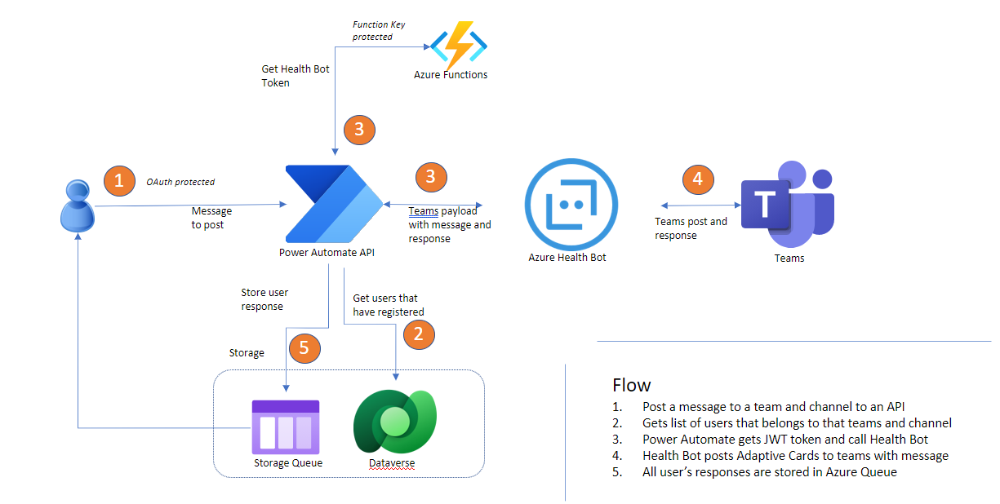

# Post messages to Teams via HealthBot
Post messages to Teams via HealthBot and Power Automate

## Application Architecture

## Pre-Requisites
1. Need permission to install apps in Teams
2. Need permission to create resources in Azure
   1. Health Bot
   2. Storage Account
   3. Azure Functions
3. Need Power Apps and Power Automate licenses

## Deploy Azure Function
1. Deploy the `ToklenFunction` in `HealthBotToken.sln` to Azure.

## Function Keys for Azure Function
The Azure function is responsible for generating the Health Bot JWT token. It leverages, by default, Function Key. Configure [Function Keys](https://docs.microsoft.com/en-us/azure/azure-functions/security-concepts?tabs=v4#secure-operation) after deployment.

## Register Health Bot in Teams
1. Create HealthBot in Azure
2. Open Health bot designer
3. From side meny, click Integration/Channels
4. Enable `Microsoft Teams` and click view.
5. Copy the `Bot Id`
6. Download the `manifest.zip` file and extract it to a temp folder.
7. Open `manifest.json` in a text editor and replace the values for `id` and `botId` with the value from step 5.
8. Zip up the contents of the folder into `manifest.json`
9. Go to Teams and deploy the bot to Teams
10. In Teams, find the bot by name or id and initiate conversation by saying `Hello`

## Import Power App Solution
1. Follow the steps to [import](https://docs.microsoft.com/en-us/power-apps/maker/data-platform/import-update-export-solutions) solution

## Import Health Bot
1. Go to Health Bot designer
2. From the side bar menu, click Scenarios\Manage
3. Click `Import` from the toolbar and select the `scenarios.zip` file.

## Health Bot Environment variables
1. `SaveTeamsContextFlowUrl` needs to point to the URL of  Power Automate Flow `SaveTeamsContextFlow`
2. `SaveUserResponseFlowUrl` needs to point to the URL of Power Automate Flow `SaveUserResponseAndConfirmFlow`

## Power App Environment Variables
Following Environment variables needs to be set in Power Apps Solution

1. HealthBotAPI - `https://bot-us.healthbot.microsoft.com/api/tenants/<<HEALTHBOT TENANT NAME>>/beginScenario`
2. HealthBotConfirmScenarioToCall - `/scenarios/postconfirmationmessage`
3. HealthBotScenarioToCall - `/scenarios/postnewmessage`
4. HealthBotTokenAPI - Azure function Url
5. HealthBotTokenAPIKey - Azure function Function-Key
6. HealthBotTokenPayload - JSON object - `{"tenantName":"<<HEALTH BOT TENANT NAME>>","jWTSecret":"<<HEALTHBOT JWT SECRET>>" }`
7. UserResponseStorageQueueKey - The storage account key

## How to post a message
1. Open A REST Client
2. Make a POST command to the Power Automate Url for the Power Automate Flow - `PostMessageToTeamsChannelFlow`

    curl --location --request POST '[INSERT PostMessageToTeamsChannelFlow URL]' \
        --header 'Content-Type: application/json' \
        --data-raw '{
            "messageToPost":"Hi all, Yaw2 is waiting at the door. Who can help him?",
            "teamName":"[TEAMS TEAM NAME]",
            "channelName":"[CHANNEL NAME]"
        }'